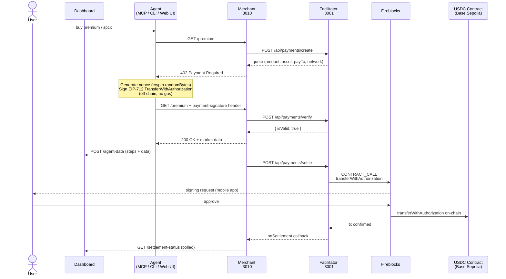

# Bloomberg Terminal — x402 Payment Flow

## Component Responsibilities

| Component | Role | Port |
|-----------|------|------|
| **Agent** | Signs EIP-3009, manages nonce, posts activity to dashboard | — |
| **Merchant** | Gates `/premium` and `/spcx`, calls facilitator, serves data | 3010 |
| **Facilitator** | Issues quotes, verifies signatures, submits Fireblocks settlements | 3001 |
| **Fireblocks** | Signs and broadcasts `transferWithAuthorization` on-chain | — |
| **Dashboard** | Polls `/agent-data` + `/settlement-status`, displays activity log | 5174 |

## Key Design Points

- **No gas for the payer** — EIP-3009 is an off-chain signature; Fireblocks pays gas for the on-chain settlement
- **Optimistic mode** — merchant returns 200 immediately after verify; settlement happens in the background
- **Nonce** — generated client-side by the agent (`crypto.randomBytes(32)`), embedded in the signed authorization, prevents replay
- **Activity log** — agent streams steps incrementally via partial POSTs to `/agent-data` as each step completes
